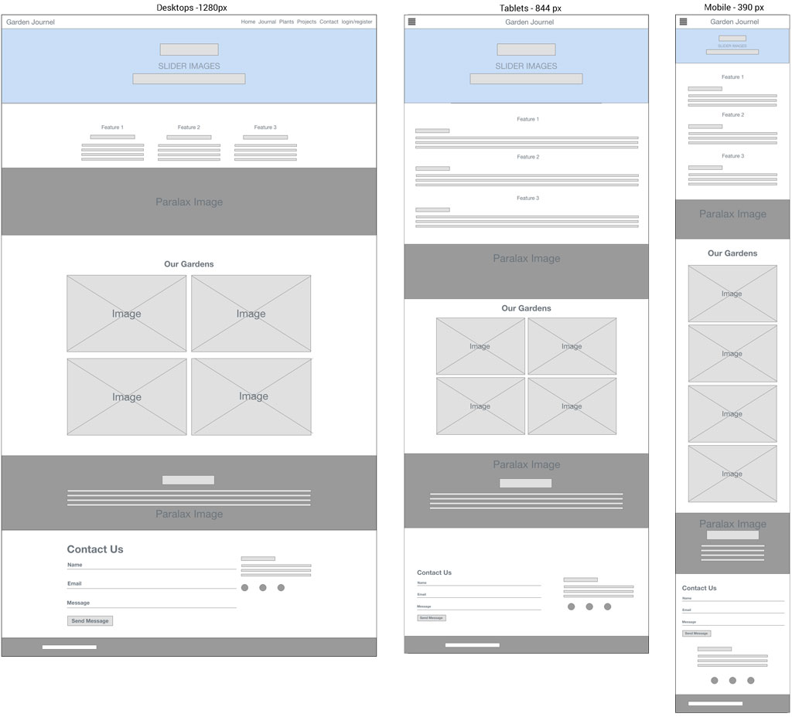
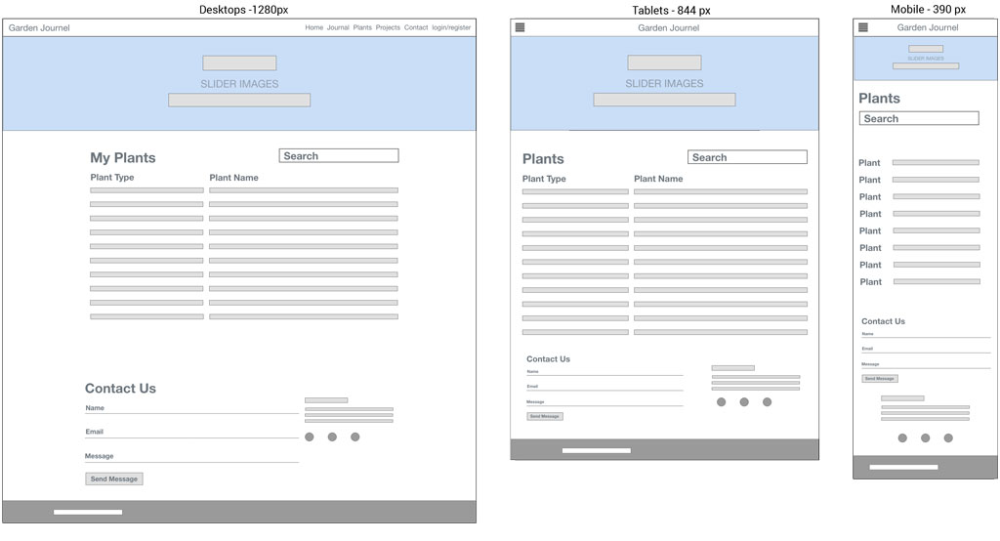

# Welcome

## Code Institute: Milestone Project 3

### Garden Journal - Daiden Sacha - Full Stack Web Developer

----------

In my garden, I find myself often trying to remember what I did in the last year, when i planted, when i fertilised and how much, and what the result was. It is cyclical, and this app is born out of the need to be able to record such events, so I can improve on them each year. I want the garden to thrive, and to produce, so in order to do that I need to know how, what and when to do what is needed. 

Link to Site

Link to testing.md 
outlines my  testing strategy, pre-development, development, deployment and post deployment.

## UX DESIGN

### 1. Strategy

##### User Stories:

1. As a hobby gardener:

	- I want to record yearly changes of individual plants.
	- I want to set up reminders for yearly maintenance tasks (like pruning, pest control etc.)
	- I'm interested in recording the time of year when plants flower
	- I would like to add my plants to a list of plants, containing information relevant to that plant. 
	- I would like to be able to add images of the plants. 

2. As a vegetable gardener:

	- I would like to set a reminder when the last frost is, so I know when it is safe to plant outside.
	- I want to set reminders for when to plant particular seeds, so they are ready to plant out after the last frost.
	- I want to record regular or yearly maintenance tasks, so I don't forget them.
	- I want to know when my fruit and vegetable crops are ready to pick.

1.  As the owner:
	- I want to engage gardening enthusiasts with the goal to build up a user base of registered users.
	- I envisage that I will be able to add pages to market a raised garden bed that I designed for growing vegetables.
	- I want users to register and log in to access the journal with garden reminders and tasks.

### 2. Scope

**Required Features**
- **Nav bar with offcanvas nav**
	- **ALL USERS** , not logged in will have access to links  
		- ***Login/Register link*** will open a modal with a login form for users to log in. For unregistered users there will be a link with a message inviting users to register.  
		- ***Contact link*** will scroll the page to the contact form at the bottom of the home page.
		- ***About link*** will scroll the home page to information about the website application.
	- **REGISTERED USERS** once logged in, will have access to additional navbar links.
		- ***Journal link*** will open a page with tabs for each month, showing logged events for each month, and allowing the user to create, read , update or delete entries. Clinking on the event name will open  the event with notes in a modal, and the possibilty to read, update or delete the entry. The user can also select an occuring event option, so the event duplicates for the next year. 
		-  ***Plants link*** will open a page of plants added by the user. The user can create, read , update or delete entries by clicking on the plant name, then read, update or delete the entrie. 
		- ***Profile link*** will open the users profile, allowing them to read, update or delete their profile. 
	- **ADMIN USERS** will have access to all the above links, as well as an admistration page to administer the user list. Admin users will be able to create, read, update or delete users and plants. 

- **Home page/ landing page** \- An engaging page with a mix of images, content and a contact form. Enough to inform users abotu the site, and to entice users to register and discover the benefits of using the garden journal. 

- **Homepage Slider** \- The slider will have 4 images, one each for "Summer, Spring, Autumn, Winder. Each image will have a label refering to the tasks for the season. The slide will revolve automatically, a subtle reference to the cyclic nature of the seasons. 

- **Modal Login form** \- The modal form will open when the navbar link is clicked, and when users are logged in, will allow access to the main application. Login success or failure will be displayed with a flash message on the home page.

- **Modal Registration form** \- The link to register will be accessable from the modal login form, and once users are registered, they wil have access to main application of the site. 

- **Display page for the calendar and events** \- The page displaying the year events will display the current month, and other months accessable though clicking on tabs. One tab per month. Events will be displayed in date order, and clicking on the event name will open the event details in a modal, where it can be read, updated, or deleted. 

- **Tabs for the months in the journal** \- Current month will be the active tab, with other months available to view by clicking on them. The tabs will be scrollable when they are wiser than the screen. 

- **Add event form** \- A button/ link in each months journal page will allow the user to add events Clicking on the button/ link will open a form with fields for entering information about the event. 

- **Edit and delete buttons for the events** \- Buttons for editing, or deleting the events will be available when clicking on the event name and opening the modal with the event information. 

**Required Forms**
- ***Contact Form:*** The user will be able to easily contact me.
- ***Login Form:*** For registered users to login  and have access to the application.
- ***Registration Form:*** Accessible from the login form, it is for new user to register to be able to use the application.

### 3. Structure

**Interaction Design**
**ALL USERS:** The site is one page with a contact form in the bottom of the page, with a link to it in the Navbar. 
Unregistered unsers are limited to viewing the homepage, withh an option to register via the link in the Navbar. They can also send a message via the contact form. 

**REGISTERED USERS:** Registered users can login, and this enables additional links in the Navbar, to a Journal page, and Plants page. 
- ***Journal page:*** 
	- In this page the events for each month will be displayed. Each event will show the date, plant name, and event name. Plant name and the event name will be links to open a model showing information about them. The model will have an edit button, delete, and close button, so the user can edit or delete the entry, with ease. A close button will close the model.
	- A button on the Journal page will open a modal form, with inputs allowing the user to easily enter new events. 
	
- ***Plant Page:*** 
	- The plant page displays a list of plants entered by the user, with the plant name being a link trigger for the modal that displays information about the plant. In the model, edit and delete buttons will allow the user to edit or delete the entry. 
	- On the plant page, a button will allow the user to add plants to the list. These plants will be displayed in a select input when so the user can choose the plant when creating an event. 
	- 
- ***Profile Page:*** 
	- This allows the possibility to create a social network around the users shared interest in gardening. Initially users will be able to edit and update name, email, password, or to delete the profile. 

**Information Architecture** Site information arranged as follows.
   There will be 3 pages for the site, with only the Homepage being accessable to users that are not registered or logged in. 
   - ***Homepage***
   - ***Journal page***
   - ***Plants Page***
   
Each page will have links to open various option, to login, register, add new plant, add new event, to edit or update plants or events. All this will be in a modal, that when closed will return the user to the page they were viewing. 
-   ***Contact Form*** will be linked in the navbar, but always accessable at the bottom of the homepage. 
    
-   ***Social Links*** placed beside the contact form will allow the users to open the linked URL in a new browser tab. 
    
-   **Planning** 
We are using mongoDB as database for the application. 

Data relationshipts:
	- **One to one:**
	- **One to many**
	- **Many to many**
	
**MongoDB**
- ***users***  (many to many)
- ***plants*** (one to many)
- ***categories*** (one to many)
- ***garden_event*** (one to one)
	- _id	   (objectId)
	- event_creator {
	    - user_id
	    - user_name
	    - user_password
	       }
	 - date
	 - category {
	     -  sow
	     -  plant
	     -  harvest
	      - fertilise
	      - spray
	      - prune
	      }
	  - plant {
		  - plant_type
		  - plant_name
		  - plant_images
		  }
	- note
	- repeats

**Website pages**
	

-   **Layout** 
    

### 4. Skeleton

**Wireframing:**

### 5. Surface

**Visual Design:**

## TECHNOLOGIES USED

**Languages Used**

1.  HTML
2.  CSS3
3.  SCSS
4.  JavaScript
5.  jQuery
7.  Python
11.  Markdown
    

**Frameworks, Libraries, Programs used**

1. [Material Design Framework](https://materializecss.com/getting-started.html)
	Responsive framework of choice for this project.
2. [Flask Framework](https://flask.palletsprojects.com/en/2.0.x/)
3. [Heroku](https://www.heroku.com/home)
	Hosting the project.
4. [mongoDB](https://www.mongodb.com/)
	noSQL database used to store non-relational data of the website.
5. [Font Awesome](https://fontawesome.com/)
	Icons used in the website.
6. [GitHub](https://github.com/)
	Used to host project repository and to deploy the project live via 	GitHub Pages
7. [Git Version Control](https://git-scm.com/)
	I used it to commit blocks of work to the GitHub repository and create branches to work on specific changes or testing.
8. [Gitpod](https://gitpod.io/workspaces)
	Editor used to work on project.
10. [Balsamiq](https://balsamiq.com/wireframes/?gclid=Cj0KCQjwgtWDBhDZARIsADEKwgNq0GvC2yRLIRMqtOQmJMttVQwRQwncxUgML3HMPxy17ZF6--foTYkaArnQEALw_wcB)
	Used to create wireframes
11. [Squoosh](https://squoosh.app/)
	I used it to compress images to optimize load performance.
12. 

----------

## Testing
Links to testing file, and plan outline

### Research

Link to research info and details.

----------

**1. What's available?** **2. How does it work?** **3. What can I expect?**

### Development

----------

### Deployment

----------

### Feedback

### Credits

## Notes

----------

## IMPROVEMENTS

**Bugs**

