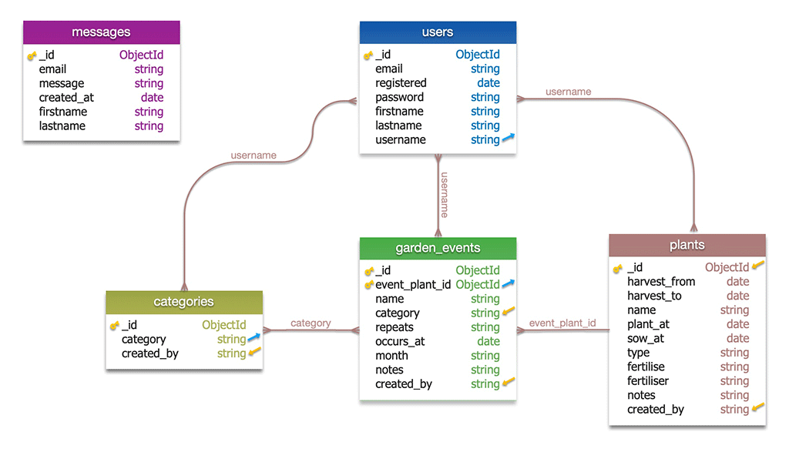
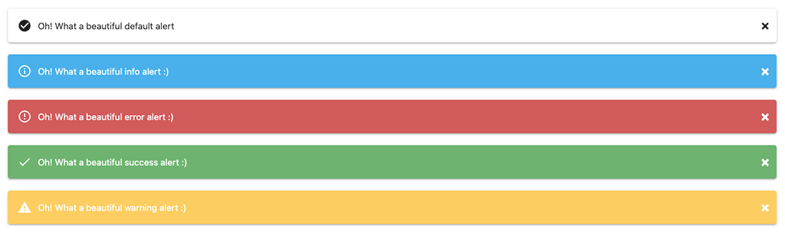

## Code Institute: Milestone Project 3

### Garden Almanac - Daiden Sacha - Full Stack Web Developer

View the [Garden Almanac](https://mp3-garden-journal.herokuapp.com/) on Heroku.

[TESTING/](/documentation/testing.md) outlines my testing strategy, development, deployment and post-deployment.

## UX DESIGN

### 1. Strategy
#### User Stories:
[TESTING/User Stories Review](/documentation/testing.md/#user-stories-review-development-deployment)

1. **As a hobby gardener:**

	- As a hobby gardener, I want to record yearly changes of individual plants.
	- As a hobby gardener, I want to set up reminders for yearly maintenance tasks (like pruning, pest control, etc.)
	- As a hobby gardener, I'm interested in recording the time of year when plants flower
	- As a hobby gardener, I would like to add my plants to a list of plants containing information relevant to that plant. 
	- As a hobby gardener, I want to edit plants and events to improve the records over time.

2. **As a vegetable gardener:**

	- As a vegetable gardener, I would like to set a reminder when the last frost is, so I know when it is safe to plant outside.
	- As a vegetable gardener, I want to set reminders for when to plant particular seeds so they are ready to plant out after the last frost.
	- As a vegetable gardener, I want to record regular or yearly maintenance tasks so I don't forget them.
	- As a vegetable gardener, I want to know when my fruit and vegetable crops are ready to pick.
	- As a vegetable gardener, I want to edit plants and events to improve the records over time.

1.  **As the owner:**
	- I want to engage gardening enthusiasts to build up a user base of registered users.
	- I want to build a base of registered users to develop a social network of users with a similar interest in gardening.
	- I envisage adding pages to market a raised garden bed that I designed for growing vegetables.
	- I want users to register and log in to access the journal with garden reminders and tasks.

### 2. Scope

#### Required Features
##### ALL USERS: 
- **Home page** The landing page will be light and fresh, with images of nature and plants.
	- **Search Filter** A search input above the collapsible on the almanac page searches the event, categories, months, plants. 
	- **Image slider** will be the main eye-catching feature of the landing page, visible as soon as users arrive at the landing page. 
	- **Material Box** Material Design implementation of the Lightbox plugin to display images. I used to show pictures of nature, to inspire and connect with users. 
	- **Navbar**
		- **Contact Form Link** will link users to the contact form.
		- **Log in link** will open the login form for users to log in. 
		- **Register link** will open the registration form for users to register. 
	- **Footer** Will hold the social links and contact icon link. 
		- **Social Icons** in the footer so users can open my GitHub and LinkedIn profiles. 
- **Contact page** Will display the contact form. 
	- **Contact form** for users to send messages to site admin.
- **Login Page** with the login form. 
	- **Login Form** for users to log in. 
- **Register Page** with the registration form.
	- **Register Form** for users to register.

##### REGISTERED USERS:
- **Navbar** - The Navbar for registered users who log in will display additional links to the journal page, plants page, add garden event page, add plants page, and add categories page. 
- **Journal page** - To display the session user's garden events in the Material Design Collapsible.
	-	**Materializecss Collapsible** - For viewing Garden Events. The header will display the event date in month/ day format. It will show the event name.
	 - **Edit button** - So users can open the edit garden event and edit plant forms.
- **Plants page** - To display the session user's plants in the Material Design styles collection (list)
- **Profile page** - To display the session user's profile in the disabled form inputs.
- **Materializecss Collection** - A Material Design style list for displaying the plants. 
	 - **Edit button** - So that users can open the edit garden event and edit plant forms.

- **Forms**
	- **Create plant** -  So users can create and add their plants
	- **Create Garden Event** - So users can add garden events
	- **Create Category** - So users can create event categories.
	- **Update plant** - So users can edit and update plant information.
	- **Update Garden Event** - So users can edit and update garden event information. 
	- **Update Category** - So users can edit and update garden event categories.  
	- **User Profile Form** (disabled for viewing only) - To display the user profile. 
	- **Update Profile Form** - So users can update select profile information.

- **Modals**
	- **View Plant Modal** - Will open when the user clicks on the plant in the list. I will display the plant information and have an edit button. 
		- **Edit button** - When the user clicks the button, they will be redirected to the edit plant page, displaying the plant information in the update plant form.
	- **Delete Plant Modal** - The modal will open when the user has clicked to delete a plant. It will display a danger alert, informing the user that the action is irreversible. 
		- **Delete Button** By clicking this button, the user confirms they want to delete the plant data. The app will delete the plant data and redirect the user to the plant's page when clicked. 
		- **Cancel Button** When the user clicks this button to cancel their intention to delete the plant, the modal will close, and the app will redirect the user to the plant's page. 
	- **Delete Garden Event Modal** - The modal will open when the user has clicked to delete a garden event. The modal will display a danger alert, informing the user that deleting data is irreversible.  
		- **Delete Button** By clicking this button, the user confirms they want to delete the garden event data. The app will delete event data, redirect the user to the journal page when clicked. 
		- **Cancel Button** When the user clicks this button to cancel their intention to delete the garden event, the modal will close and redirect the user to the journal page. 
	- **Delete Category Modal** - The modal will open when the user has clicked to delete an event category. The modal will display a danger alert, informing the user that deleting data is irreversible.  
		- **Delete Button** By clicking this button, the user confirms they want to delete the event category. The app will delete the category and redirect the user to the add category page when clicked. 
		- **Cancel Button** When the user clicks this button to cancel their intention to delete the event category, the modal will close. The app will redirect the user to the add category page. 

##### ADMIN USERS:	
- **Navbar** The Navbar for admin will display an additional link to the messages page.  
	- **Messages page** to display the session user messages.
		**Materialize Collapsible** for viewing messages; the collapsible header has a delete button that will open the modal when clicked to confirm the deletion.
			- **Delete button** - So admin can delete the user messages.
		- **Delete Message Modal** - The modal will open when the user has clicked to delete a message. The modal will display a danger alert, informing the user that deleting the message is irreversible.  
			- **Delete button** - So admin can confirm deletion of the user message.
			**Send Email button** - To reply to the user in the computer's default email app. 

#### Functional Requirements
- **Image slider** It will have four images and automatically scroll at intervals of around 10 seconds, enough time for users to view the images. The transition of the images, each representing a season, relates to the cyclical nature of existence and events. The images will give the impression of looking through a window.
- **Material Box** Images in the Lightbox plugin will expand when clicked and revert to their initial display when the user clicks the screen is once again. The images are to illustrate the beauty of nature. 
- **Navbar** The Navbar for non-session users will display links to the login page, register page, and contact page.
- **Contact Form** The form inputs will have multiple levels of validation. 
	- **Browser side validation** will utilize the Material Design class `validate`. When users click fields without filling them in, a red line will appear under the input. If the user has not entered information, a tooltip message will appear asking the user to fill in the form input. 
	- **Server Side Validation** is handled by Flask-WTForms, and defined in the form class. Inputs that fail validation will display a red message under the form input, informing the user what is needed to pass validation. An error alert will appear, telling the user validation has failed. When the form validates, the app sends the information, and a success alert informs the user the message has been sent. 
- **Login Page** The user will be required to enter their username and password to log in. If they enter correctly, a session cookie will be created. The app will redirect users to the profile page, and the additional functionality will be available for the user. If they enter incorrect information, an error alert appears, informing the user the details were wrong. 
- **Registration Page** The user registers by completing all the fields in the registration form. The browser validates the fields, and a tooltip appears with a validation message if a form field fails validation. If the form passes validation, the user is logged in and redirected to the profile page.
-	**Materializecss Collapsible** The header displays the "Month/ Day", event category, and event name. The collapsible is closed by default, and the user can click on the header to open the accordion. When opened, the user can see the event and plant information. An edit button for the plant, and one for the event, link to the respective edit pages. 
- **Search Filter** The user can filter events by events name, category, month to quickly find required events.  

#### Content Requirements
The garden almanac revolves around creating a record of recurring events in the garden. The goal is to develop and improve knowledge based on historical experience recorded in the application's events, plants, and categories. Data is displayed in a yearly event calendar to manage and get the most out of the garden. Some fields in the forms for entering the data are required to show the events and plants. Other form fields are optional, so the user can enter this content if it suits them. 

### 3. Structure
#### Interaction Design
##### ALL USERS: 
The site has a landing page and a contact form.

Unregistered users are limited to viewing the homepage, with an option to register via the link in the Navbar. They can also send a message via the contact form. 

- ***Contact Page:*** Users will be able to contact me to give feedback or to ask for support or feature requests. Contact easily accessible from the main Navbar or a link in the footer. 

##### REGISTERED USERS:
Registered users can log in, enabling additional links in the Navbar to a Journal page and Plants page. 
- ***Journal page:*** 
	- A search filter will be above the accordion on the page so that the user can enter the month, plant name, event category to quickly filter the events. The user experience will be maintained as the list of events grows. 
	The app will order items by month and day to reflect the cyclical nature of events.- An accordion will display the events, and all list items in the accordion will be closed by default and ordered by date. Users can click on an event, and the accordion item will open, displaying the event and related plant, with edit buttons to directly open and edit either item. 
	
- ***Plant Page:*** 
	- The plant page displays a list of the user's plants. 
	- The user can click on a plant, which will open a modal displaying the user's plant information. 
	- The modal will have an edit button that will link to an update plant page, where the user can update or delete the plant information.
	
- ***Profile Page:*** 
	- A disabled form on the page will display the registered user's information. An edit button will open an edit profile page, with some fields editable so the user can update their information.

#### Information Architecture
 There will be three pages for the site, with only the Homepage being accessible to users that are not registered or logged in. 
 
 **CRUD Update forms** 
 - ***Forms:*** The app will display information for each user on pages. It will contain edit links that will redirect to the update/edit page, where the forms will automatically display the item the user wishes to edit. Some fields in the related forms will be required, and others are optional but clearly labeled. The user can change and update information quickly, and the app redirects them back to the related item group. The update forms will have a save, delete, or cancel button for the user. 

**CRUD Delete structure** 
- ***Forms and delete process*** The user can click the delete button on the update item page, which will open a modal with a danger alert, informing the user that deleting the data is irreversible. They can choose from the delete, or cancel buttons, to delete or cancel and return to the related items group page. 
   
**Visible to all users**
  - ***Homepage***
	   - Home page navigation will link to the contact form at the bottom of the page, also the login/ registration form. 
	   - There will be a slider with images relating to the four seasons. These images are a feature, and I kept them in the base template to view them on all pages. 
	   - A collection of images to inspire interest in gardening. 
   
**Visible to registered and logged in users** 
  - ***Journal page***
	   - Will display the events for the user's garden.
	   - Buttons to open a form to add, update or delete an event will open a modal window so users can add, edit or delete. 
	   - Event name and plant name will be links that will open the corresponding entry so users can view, update, or delete.  
  - ***Plants Page***
	   - Will display a list of the plants entered by the user.
	   - The plant name in the list will be a link that opens the plant profile in a modal window so users can view, update, or delete.
   
### MongoDB  
[TESTING/MongoDB](/documentation/testing.md/#mongodb)

I decided to create separate collections for users, event categories, and plants. The fourth collection will be the garden events, which will contain information about the event. Within the garden event entry, I will record the plant id, the user id, and the category to make it easy to filter the database for the information. During development, I created a message feature for the admin and displayed messages in the admin account. To this end, I made one more MongoDB collection for messages. 

#### MongoDB Schema Design

  

**Crucial considerations in designing the above schema**

1. ***Users will create events related to plants.***
The user is required to select a plant from the list of their created plants to create an event. The plant ObjectId is then saved in the ```garden_event``` collection as the 	```event_plant_id```. The ObjectId is immutable, whereas if I used the plant name, the user could update and change that, then it would be more complex the maintain the connection between the event and plant. 

2. ***Users will be able to group types of events by category.***
Events are many, but users can group them into few categories. Those categories often relate to seasons, so it is easy to see the types of approaching events by filtering by category. For this reason, I've created the category collection so users can create and edit or delete categories. When creating an event, users can choose the categories from a select input. 

3. ***Plants, events, and categories will be associated with the creator of them.***
Once registered, the user cannot change the user name, and all plants, categories, and events created by the user will contain the field ```created_by```. In this way, I am easily able to filter the collections for items created by the user.

4. ***Plants, events, and categories will be only viewable by that user.***
I have used the user name as the session cookie to identify the user and filter out the displayed items for that user. I felt this was important, as the list of events will grow exponentially. It will detract from the user experience if the list of plants, events, and categories contains other users' items. 

5. ***Admin can view messages sent from the site's contact form.***
For the sake of the learning experience and in step with the project's learning objectives, I specifically chose not to use JavaScript to process and send the contact form messages. I wanted to use Python, and this solution came to me after I created the Flask-WTForms form. I realized how easy it would be to create a MongoDB collection and POST the message data to the database. From there, it's a simple task of building the HTML template to display the messages. 
6. ***Dates in MongoDB in ISODate format.***
I'll be honest and say this was a dive into learning something very new for me. The Material Design date picker is responsive and works well. However, it serves the date in string format, which I discovered when posting form dates to the database collections. I chose to convert the date to ISODate format to store in the database, and it's pretty straightforward once you get used to it. 

I decided on the following schema, using collections to separate group groups of data, users, plants, categories (event), garden_events, and messages. 

#### MongoDB Collections

***Users***
The Garden Almanac revolves around the users and garden events.  The ```username``` is what links plants, events and categories. When the user creates a new item for plants, events, or categories, the app inserts their  `user_name` as a reference key `created_by`. I can match the session user with the ```username```  key in the collections to retrieve the user's data from the database. 
```javascript 
	users  {
		_id: 			<ObjectId>
		username: 		<string>
		email: 			<string>
		registered: 		<date>
		firstname: 		<string>
		lastname: 		<string>
		password: 		<string>
       }
```


***Plants***
The ```created_by``` key is the ```usename``` of the user and what I use to link the plant entry to the user. The remaining combination of fields is for gathering relevant information to fulfill the needs of the user. Some fields are required, so there is information to populate the pages with something suitable for the user. Other form fields are optional so that the user can cater to various plants, ornamental or productive. 
```javascript 
	plants  {
		_id: 			<ObjectId>
		type: 			<string>
		name: 			<string>
		sow_at: 		<date>
		plant_at: 		<date>
		harvest_from: 		<date>
		harvest_to: 		<date>
		fertilise: 		<string>
		fertiliser: 		<string>
		notes: 			<string>
		created_by: 		<string>  
    }
```   
***Categories***
The user has total discretion to group the types of events how they prefer, which will suit their needs and desire to search or filter infomtation. The user can add, edit and update, or delete  categories, which are displayed in a select input in the add or edit ```garden_event``` forms. The user is required to select a category when creating an event. 
```javascript  
	categories  {
		    _id: 			<ObjectId>
		    category: 			<string>
		    created_by: 		<string>
	}
```
***Garden Events***
The pivot of the whole application concept hinges on relationships to categories and plants.  I used the plant ObjectId as the pseudo foreign key to link events with the related plant. The ObjectId is unique to the plant and immutable, enabling me to maintain the link without complications if I use a field that users can edit. Some fields are required, and other optional, similar reasons for the same in the plant's collection. I stored dates in ISODate format. I also saved the date in month string format and included them in the indexing of the database so users can enter month names to filter events by month.  
```javascript 
	garden_events 	{
			_id: 			<ObjectId>
			category: 		<string>
			event_plant_id: 	<ObjectId>
			name: 			<string>
			repeats: 		<string>
			occurs_at: 		<date>
			month: 			<string>
			notes: 			<string>
			created_by: 		<string>
	}
```
***Messages***
It was not my initial plan, but I was inspired when I worked out what to do with my contact form data. I used `flask-wtf` forms to build the contact form and validation. For the sake of the learning process, I resisted using JS to handle the form and send it via a third party. In a moment of enlightenment, I had the idea to create the collection to store the message data, and I created an Admin Message Inbox to display the messages. 
```javascript 
	messages	{
			_id: 			<ObjectId>
			firstname: 		<string>
			lastname: 		<string>
			email: 			<string>
			message: 		<string>
			created_at: 		<date>
	}
```
#### Database Issues and Notes 
1. ***Linking garden_events with plants*** As explained, I used the plant ```ObjectId``` and store it as an ```ObjectId``` in the ```garden_event``` collection under the key name ```event_plant_id```. I initially tried using the plant ```name``` field but encountered complications. I stored the plant ```name``` in the ```garden_event``` collection and used it to link the two.  When the plant ```name``` was changed and updated, that method required simultaneous coding changes to the same field in ```garden_event```. It was the first time I used an immutable field for such linking, and I changed to using the plant ```ObjectId```. 
It was a little complicated because there is very little information written in simple terms for someone learning. I  used the string format of the ```ObjectId``` in the select option, retrieve that when the form is POST"ed, insert it in ```event_plant_id:ObjectId("string_format")``` and store it as the ```ObjectId``` in the ```garden_events``` collection. This way, it is easy to loop through and compare items from the two collections to find a match for the ```ObjectId```.
2. ***Time format*** I'm sure every developer encounters this and has to learn it.
Materialize Design date picker allows you to format the required date however you want to get it. However, it creates a date string, and if you (like me) chose the date field type in MongoDB, it overwrites that and stores a string in the database collection field. You will encounter Jinja errors when you expect a date format and display it in your HTML template.  
In the jQuery function for the date picker, my chosen format to display the date was ```format: "mmmm dd, yyyy",``` i.e., February 10, 2021. My solution was as follows. 
-	Step 1. Store string in variable. ```date_string = request.form.get("occurs_at")```
-	Step 2. Convert string to ISODate ```date_object = pd.to_datetime(date_string)```
	-	Note that I used Pandas here, for simplicity, as with datetime, you need to specify the format of the date string you're converting, i.e. ```date_object = datetime.strptime(date_string, '%B %d, %Y')``` . View [Documentation for strptime() Behavior](https://docs.python.org/3/library/datetime.html#strftime-and-strptime-behavior)  along with a list of the Format codes.
- Step 3. Upload the date to MongoDB. I converted the date from ```"February 10, 2021"``` to ```2021-02-10T00:00:00.000+00:00``

	As I worked through the project, I had to use the datetime format codes to display the date as I wanted to show it, so I got used to it and realized that it is easy to display the date in whatever format you want. I stored all my dates in ISODate format in MongoDB unless I wanted to keep it as a string. I have stored the month name in the garden_events collection for indexing, so users can search and filter by month name.

### 4. Skeleton

#### Wireframing:
I completed the wireframes in Adobe XD, and I kept them simple to display the layout of the required components. I have used Materializecss as the framework and based my work around a simple free template I found at [materializecss themes](http://swarnakishore.github.io/MaterializeThemes/#themes). 

**Home page wireframes**    


**Journal page wireframes**    


**Plants page wireframes**    


### 5. Surface

**Visual Design:**
I selected four stock images to represent each season and display them in a carousel slider directly under the navigation. The image carousel automatically changes images every 10 seconds, so the user has time to view each image. This feature will be visible on all pages, along with the navbar. 

I have included the contact form so the users can quickly contact me, and there is a link in the navbar that scrolls the page to the contact form. 

I included images of fruit and vegetables to inspire users to make use of the application. Event names and plant names open the related events and plant profiles, easily viewed, updated, or deleted. It happens in a modal that, when closed, returns the user to the same page. The app has a fixed navigation bar, so it's easily accessible and always visible. The site is simple, and the styling and functions are consistent across pages. 

## TECHNOLOGIES USED

**Languages Used**
1.  HTML
2.  CSS3
3.  SCSS
4.  JavaScript
5.  jQuery
6.  Python
7.  Jinja
8.  Markdown

**Frameworks, Libraries, Programs used**

1. [Material Design Framework](https://materializecss.com/getting-started.html)
	The responsive framework of choice for this project.
2. [Flask Framework](https://flask.palletsprojects.com/en/2.0.x/) 
     Used to display data from MongoDB in the front-end templates.
3. [Heroku](https://www.heroku.com/home)
	Hosting the project.
4. [mongoDB](https://www.mongodb.com/)  
	NoSQL database for storing non-relational data of the website.
6. [Flask-WTForms](https://flask-wtf.readthedocs.io/en/0.15.x/) 
    A simple integration of Flask and WTForms, offering validation and implementation using Jinja. 
7. [Font Awesome](https://fontawesome.com/)
	Icons used in the website.
8. [GitHub](https://github.com/)
	Used to host project repository and to deploy the project live via 	GitHub Pages
9. [Git Version Control](https://git-scm.com/)
	I used it to commit blocks of work to the GitHub repository and create branches to work on specific changes or testing.
10. [Gitpod](https://gitpod.io/workspaces)
	The editor used to work on the project.
11. [Adobe XD](https://www.adobe.com/products/xd.html) 
	Used to create wireframes
12. [Adobe Photoshop](https://www.adobe.com/products/photoshop.html)
	I  used the software to work on the project images.
13. [Adobe Illustrator]([Adobe Illustrator](https://www.adobe.com/de/products/illustrator.html)
	Used to create my 404, 405, and 500 error images to display if users encountered missing or broken page links.
14. [Squoosh](https://squoosh.app/)
	I used it to compress images to optimize load performance.
15. [Quire](https://quire.io/)
Free project and task planning application used for adding and planning tasks for the project.
16. [Depositphotos](https://depositphotos.com/?gclsrc=aw.ds&&utm_source=google&utm_medium=cpc&utm_campaign=DP_EU_EN_Brand_Search&utm_term=depositphotos&gclid=CjwKCAjwuvmHBhAxEiwAWAYj-EVeHDBPdjs594mAT_HDLeFGM_g2IVcGn78NSArH7vXIYqfoO1BuhBoCv_kQAvD_BwE)
My source of choice for stock images.
17. [StackEdit](https://stackedit.io/)
	It's a free, online note-taking and markdown application. I used it to create the README file for GitHub.
18. [Webmaker App](https://webmaker.app/app/) It is a free application similar to codepen, used to create and save the work locally. I use it to implement and experiment with using components of different frameworks that I am using, so I am familiar with how to use them when I come to implementing them in my work. 

## TESTING
[TESTING/Testing Checklist](/documentation/testing.md#testing-checklist-development-deployment)
### Research

[TESTING/Research](/documentation/testing.md/#research)

---
Having decided to use Materializecss, I became familiar with the framework, syntax, and available components. I needed to see what is available to meet my needs to implement my design requirements how I need them to be.
I test and experiment locally using [Webmaker App](https://webmaker.app/app/), as it's free, works well, and I can create codepen examples of what I want to implement with select components. I can save these to an HTML document to share prototypes with clients or associates. 
- ***Grid*** It's pretty straightforward and similar in many ways to bootstrap. Some class names are similar, i.e. ```.row``` and ```.col```. The grid class syntax is also pretty simple to grasp. 
- ***Collapsible*** The Material Design name for what is better known as an accordion. I needed to research how to implement the accordion and decide how to display the garden event information. 
- ***Collection*** Material Design name for a list. I wanted to use it for displaying the list of plants and also the list of categories. 
- ***Tabs	(conflict)*** My initial plan was to show the events by month in tabs, but Materializecss uses the image carousel css in the tabs, which created a conflict with the image slider. The tabs automatically scrolled. Furthermore, with limited time to sort the issues, I decided to go an easier route. I didn't use tabs in my project, and overall I'm happy I went the "Collapsible" route.
- ***Image slider*** One image relating to each season, Spring, Summer, Autumn, Winter. I wanted to have this as the main feature when the user lands on the homepage.  I found my images on Deposit photos and created the slider images from the stock images.
- ***Forms*** I needed to look at the form elements, see the implementation procedure, to know in advance what I was going to implement before I came to it. 
- ***Modal*** The plan was to use modals to display plant information and the contact form. I changed the contact form from HTML to Flask-WTForms to stay with Python, so I did away with the form modal. I used modals for the delete confirmation messages.

***Material Design Template*** I wanted to use the Material Design framework, so I spent a little time looking at what was online regarding templates. I came across [Materialize Themes](http://swarnakishore.github.io/MaterializeThemes/#themes) and found inspiration in what I saw. The theme I chose was using an older version of materializecss, so I needed to go through it from top to bottom as some things needed to be updated to work with the latest release. 
I customized it how I wanted it, kept some things, and started my project. I created the home page locally, customizing the theme and updating it, changing it to suit my needs. I added the image slider, created an HTML form in the bottom sheet modal, and added the menu as I would want.
- ***Stock images*** [Deposit Photos](https://depositphotos.com/?gclsrc=aw.ds&&utm_source=google&utm_medium=cpc&utm_campaign=DP_EU_EN_Brand_Search&utm_term=depositphotos&gclid=CjwKCAjwuvmHBhAxEiwAWAYj-EVeHDBPdjs594mAT_HDLeFGM_g2IVcGn78NSArH7vXIYqfoO1BuhBoCv_kQAvD_BwE), my first stop for stock images when I need them. I found the pictures I needed for the image slider and also for the parallax. 

- ***Mongo DB Schema design*** With zero experience creating or building any database, apart from the Code Institute code along project, I was overwhelmed. I read so much information, watched so many youtube videos. I had all the info, but it was abstract without a reference point of experience to understand it in real terms. I often heard that the database design depended on the needs of the applications. I spent the first week researching just this, and with time flying, I decided to jump in and learn in the end. For the most part, the finished product is very close to what I planned, apart from a few changes I made to improve things (to meet the application's needs). 

### Development
[TESTING/Development](/documentation/testing.md/#development)


#### Create Mongo DataBase
1. Navigate to mongodb.com, register, and create an account. 
2. Create a free shared cluster 
3. Select a cloud service. I chose AWS.
4. Select the closest region to you offering a free service. I chose Frankfurt.
5. Choose the cluster tier, M0 Sandbox (free forever)
6. Scroll down and select Cluster Name, and name your cluster.
7. Click on the "Create Cluster" button.
8. Click on Database Access in the menu on the left.
9. Click on "Add New Database User"
10. Create a user name and password using only a combination of letters and numbers.
11. Set User Privileges to "Read and write to any database"
12. Click Add User.
13. Click on Network Access in the menu on the left-hand side.
14. Click Add IP Address, and here you can click "Add Current IP Address" to limit access to the database, or click "Allow Access From Anywhere" if you want to access from different locations. 
15. Click Clusters in the menu on the left, and click on "Collections".
16. Click "Add My Own Data", and here you can create your database and add your first collection name. Click Create. It can take a few minutes. 
17. Click on "Create Document" to create your first document of key-value pairs. (I created example values to start with) Also, select the type of field. 
18. Once complete, click "Insert" to insert the document into the collection. 

#### Create Project

- **Create Project Repository** I used the Code Institute [gitpod-full-template](https://github.com/Code-Institute-Org/gitpod-full-template). I clicked on "Use this template" and created my project repository name "mp3-garden-journal". I then opened this in GitPod to start the project. 

-   **Initialise Git**  To begin my project, I started with  `git init`  to initialize git within the project.
    
-   **Git Ignore**  I created a  **.gitignore**  file to add files and directories I didn't want to upload to GitHub.
    
    `git echo "file_name" >> .gitignore`  is the terminal command I used to add files and directories to  **.gitignore**.

- **Create Application File Structure**
	 - Once I had the project in GitPod,  I created the initial file structure needed to get started.
	 ***Create folders***
		```bash
		mkdir templates static static/css static/js static/images 
		mkdir documentation documentation/images documentation/images/wireframes
		```
		
		***Create files***
		```bash		
		touch app.py env.py Procfile README.md css/style.css js/main.js 
		touch templates/base.html templates/home.html
		```
		```bash
		|-- documentation/
		|	|-- images/
		|	|	|-- wireframes
		|-- static
		|	|-- css/
		|	|	|-- style.css
		|	|-- images/
		|	|-- js/
		|	|	|-- main.js
		|-- templates/
		|	|-- base.html
		|	|-- home.html
		|--	.gitignore
		|-- app.py
		|--	env.py
		|--	Procfile
		|--	README.md
		|--	requirements.txt

		```
		
- **Implement Flask app**
	- The ```env.py``` file stores sensitive information that is not committed or pushed to GitHub, so I added it to the ```.gitignore``` file. ```$ echo 'env.py' >> .gitignore```
	- I entered imported the os into ```env.py```, and added the environment variables that will contain the application's sensitive information for connecting to MongoDB.
	- I then initialized Flask in the ```app.py```. 
	- I imported the dependencies required by the application in ```app.py```
	- I created the app route to create the home page. 
	- For development, I have ```debug=True``` in the ```app.py```.
		```python
		@app.route("/")
		def home():
			return render_template('home.html')
		``` 
	
 - **Implement The Materialize Template**
	 - I created my template locally and customized it, so it was simply a matter of copying my HTML into the base.html. 
	 - I decided to keep the image slider in the base template to be visible on all pages. The section between that, and the footer, I moved to the home.html.
	 - In the ```base.html``` I added the links to jQuery, materialize js and css, and the main.js and style.css files. I also add a link to font-awesome.
	 - I tested the app. In the terminal, ```python3 app.py``` then clicked open in the browser. The app was working, and my template was showing.

- **Create login and register page and function**
**NOTE** I based the login and register route code on the Code Institute Task Manager project. There wasn't a lot to change to use it in my project as it functions and does want I want it to do. I made some minor changes to fit the app's requirements. See [Credits](/README.md/#credits) at the end of the README.
	- ***Create the HTML template*** to extend the base template for login.
		-	```touch templates/login.html```
		-	I added start and end blocks using Jinja.
		-	I added the app route to the navigation links.
	- ***Create the required log in form***
		- I added form elements for: 
			- input type: text for username
			- input type: password for password
			- button for submit
		- I added browser validation "pattern".
	- ***Copy the login HTML template and create register HTML template***
		- ```cp templates/login.html templates/register.html```
		- Add additional form elements required for registration
			- input type: text for first-name
			- input type: text for last-name
			- input type: email for email
	- ***Create the app route and function*** for login and register in ```app.py```
		- I used the Code Institute Task Manager project as a guide to step through building the functions for login and register. 
		- For security I used ***werkzeug.security***  ```generate_password_hash, check_password_hash```
		- In the registration form, I check the username registered before posting the form data. The app displays Flash error messages or success messages for error or success.
		- I completed the registration form and tested it to confirm that error and success flash messages worked. The app added a new user to the user's collection.
		- A session cookie is created for the user when their username and password is validated.
		- I completed the coding for login, checking flash error and success messages, and the registered user can log in. 
		
**Issue:** I added flash messages in the login function that appeared but had no styling. I wanted to add alert message styles to the messages. My solution was to use ***materialert*** and ***flashing with categories***

- ***Materialert alert messages***  
	- Materializecss doens't have alert messages like in Bootstrap, or UIkit.
	- I found [Materialert](https://github.com/Rinebeck/materialert) which creates and styles alert classes. 
  

- ***Flashing with Categories*** Flask flash messages allows for [adding a second value to the flash message](https://flask.palletsprojects.com/en/2.0.x/patterns/flashing/#flashing-with-categories).  
	- In the HTML template flash message section per documentation:
	- Example as follows.
	
- ***Python App Route function - add class name***
	
	```python
	flash('Invalid password provided', 'error')
     ```
		
- ***HTML Template***
	```html+jinja
	
	
		<div  class="row alert-section">
		
			<div  class="materialert {{category}}">
				<span>{{ message }}</span>
				<button  type="button"  class="close-alert hide-on-small-only">×</button>
			</div>
		
		</div>
	
	
	```
	- I used this method to add materialert class names to the flash messages. 
	- **Note:** Initially, per the Code Institute Task Manager Project, I contained this block in section tags. When there are no messages, the page had empty `<section></section>` tags, semantically incorrect. Firstly, to have an empty set of tags on the page is wrong, and secondly, when validating the HTML, it returns an error as `<section>` tags should have a `<h1>`-`<h6>` heading inside them. 
	- My solution was to add the `<div  class="row alert-section"></div>` inside the if statement, with the class name alert-section. This whole block, `<div>` included, is only displayed with an alert message. For readability, the class name indicates what the block is. 


- ***MongoDB: Add sample data for testing HTML templates*** 
	- In Mongo Atlas, I added sample data to the database collections:
		-  garden_events
		-  plants 
		- categories

- **Create HTML Templates to for garden_events, plants, categories**

	 - I created the HTML templates required to display garden events, plants, and categories. 
		 ```bash
		 touch templates/journal.html 
		 touch templates/plants.html 
		 touch templates/add_categories.html
		```
	**NOTE**: The app displays categories in a list below the form input for adding event categories. 
	- I created the HTML to display the sample information I added to the database. I added the collapsible to the journal.html page to show the event information. I added the app routes to ```app.py``` for the pages and links to the navigation. 
	- It took me a little while to get into Jinja, but I found it relatively straightforward. Once I had the routes added in the base.html nav links and the app routes completed, I tested it.  Again ```python3 app.py``` to see the result in the browser. 
		If I made a python mistake in my ```app.py ``` file, the development server closed, and the error message showed me where my mistake was.- If I made a mistake in my Jinja, it was shown in the browser, and Jinja informed me of the location of my error.
	- It was a process, and I worked methodically through each page, making sure it worked. I had no real issues getting the information from the database and displaying it on their respective pages. My journal page was a little complicated because I pulled info from 2 separate collections, matched the plant with the event, and displayed both sets of information in the collapsible. For this, I needed to nest my Jinja loops, and I also included modals, adding another layer of complication. The jounal.html and plants.html pages were both working, so I move forward.

 - **Add Create Functionality**
	 - ***Create HTML template files***
	 	```bash
		 touch templates/add_event.html 
		 touch templates/add_plant.html 
		```
	**NOTE:** Page for displaying categories was already created and had the input for adding event categories.
	- ***Pages: garden_events, plants, categories***
		- I added forms with the required inputs for added the data needed for the database fields. 
		- Created the app route functions for getting the form data, and adding it to the database. 
		- I added the app route path form action, i.e. `action="{{ url_for('add_plant') }}"`
		- I added the app route to the navigation links.

	 - ***Collections:***
		 - ***add_garden_events***
			 -  ***Considerations***
				 1. This app route function needs to access the `garden_events` and `plants` collections to display the event and the related plant data. [See Database Issues and Notes](/README.md/#database-issues-and-notes) for how I used the plant `ObjectId` This is required to match the plant `ObjectId` with the `event_plant_id` used in the  in the  `garden_events` collection.
				 2. I save the `date_object` in ISODate and month string format in the `garden_events` collection. It is inserted in month format so the user can filter by month name.

					 ```python
					# get date string and convert to date object
					date_string = request.form.get("occurs_at")
					date_object = pd.to_datetime(date_string)
					# get date string and convert to month name
					month = date_object.strftime("%B")
					# insert key value pairs to garden_events collection
					"occurs_at": date_object,
					"month": month,
					```
			 - I created the app route and function for the page, added the route to the form and the Navbar link.
			 - I added details into the form, clicked add the event, and inserted the data into the `garden_events` collection. 
			 -  The event is also displayed on the almanac page collapsible. 
				
		 - ***add_plants***
			 - ***Considerations:*** 
				 1. There are four date fields in the add_plants form. To save them to the database, I converted the strings to ISODate. [See Database Issues and Notes](#database-issues-and-notes)
				 2. Two date fields are optional. I need to code in a check to see if this was an empty
			string, or had a string value, so it was only converted to a date object if there was a value.
			- Adding plants to the database works. If a user chooses a date, it is converted to ISODate and uploaded to the DB. If the user doesn't select a date, the app inserts the empty string into the DB. 
		 - ***add_categories*** 
			 - The form for creating categories has only one input, so it was relatively easy to code. 
			 - I created the app route and function to add a new category.
			 - I enter the app route in the form and the Navbar link.
			 - I enter a new category, enter create. The function uploads the new category and the session `user_name` to identify the field with the session_user.

 - **Add Update Functionality**		
	 - ***Create HTML template files***
	 	```bash
		 cp templates/add_event.html templates/edit_event.html 
		 cp templates/add_plant.html templates/edit_plant.html
		 cp templates/add_category.html templates/edit_category.html 
		```
	- ***Pages: garden_events, plants, categories***
		- I copied the `add_event`, `add_plant`, `add_category` HTML templates with the required forms for updating the data in the database fields. The inputs for adding the data are the same inputs used to update the data.
		- Created the app route functions for getting the form data and adding it to the database. 
		- I added the app route path form action, i.e. ```action="{{ url_for('edit_plant', plant_id=plant._id ) }}"```
		- I added the app route path to the Edit buttons displayed when viewing the data.
		- In the `app.route` and function I added the item_id to get the item to edit.  The following example shows how the `plant_id` is added to the route, and to the function. That same `plant_id` is used in the `update({"_id": ObjectId(plant_id)}, submit)`
			```python
			@app.route("/edit_plant/<plant_id>", methods=["GET", "POST"])
			def edit_plant(plant_id):
				if request.method == "POST":
				
				# function code block removed
				
				mongo.db.plants.update({"_id": ObjectId(plant_id)}, submit)
				flash("Plant Successfully Updated", "success")
				return redirect(url_for("get_plants"))
			plant = mongo.db.plants.find_one({"_id": ObjectId(plant_id)})
			plants = list(mongo.db.plants.find().sort("type"))
			return render_template("edit_plant.html", plants=plants, plant=plant)
			```
	 - ***Collections:***
		 - ***garden_events***
			 - The route path and function include the event_id. `if request.method == "POST":` the application searches the collection for the event_id and updates the data. 
			 - **NOTE** The `url_path` in the `edit_event` form.  See [edit_event HTML template](/templates/edit_event.html), line 9.
			 
				```html+jinja
				{{ url_for('edit_event', event_id=garden_event._id) }}
				```
				Here is a good example. The function assigns the value of the event to the function event_id variable. The `event_id` is the variable used in the function, and the `garden_event._id` is the collection event id.
			- When the update is complete, the app function redirects the user to the almanac page.
		 - ***plants***
			 - The route path and function include the plant_id. `if request.method == "POST":` the application searches the collection for the plant_id and updates the data. 
			 - When the update is complete, the app function redirects the user to the `plants` page.
		 - ***categories***
			 - The route path and function include the category_id. `if request.method == "POST":` the application searches the collection for the category_id and updates the data. 
			 - When the update is complete, the app function redirects the user to the `add_category` page.
 - **Add Delete Functionality**
	 - ***Add Delete buttons HTML template files***
	 I created an app route and `delete_item` function. Example:
		```python
		@app.route("/delete_event/<event_id>")
		def delete_event(event_id):
			mongo.db.garden_events.remove({"_id": ObjectId(event_id)})
			flash("Event Successfuly Deleted", "success")
			return redirect(url_for("get_garden_events"))
		```
		
		- For each of the collections, I added a delete button on the `edit_item` page. The button is a modal-trigger with `href="#delete-event-modal"` that opens a modal asking the user to confirm they want to delete the data.
		- I added the modal with the id of the modal trigger button `href`,
		I added the 'delete_item' route in the 'href' of the delete button in the modal.
		```html+jinja
		{{ url_for('delete_event', event_id=garden_event._id) }}
		```
		- When the user clicks delete on the update_item page, it opens the modal informing the user deleting the data is irreversible and asks if they are sure they want to delete the item. The user can choose to delete or cancel. In both cases, the app redirects them back to the main page for viewing the items. 
	 - ***Collections:***
		 - ***garden_events***
			 - I select a `garden_event` to edit, the data is displayed in the inputs of the `edit_event.html` form. 
			 - I click delete, and the modal opens, informing me deleting the data is irreversible. 
			 - I click delete again, the modal closes and redirects me back to the `get_garden_events` page. 
			 - A success alert informs me the deletion was successful. The event is no longer on the list. 
		 - ***plants***
		 	 - I select a `plant` to edit, the data is displayed in the inputs of the `edit_plant.html` form. 
			 - I click delete, and the modal opens, informing me deleting the data is irreversible. 
			 - I click delete again, the modal closes and redirects me back to the `get_plants` page. 
			 - A success alert informs me the deletion was successful. The plant is no longer on the list. 
		 - ***categories***
		 	 - I select a `category` to edit, the data is displayed in the input of the `categories.html` form. 
			 - I click delete, and the modal opens, informing me deleting the data is irreversible. 
			 - I click delete again, the modal closes and redirects me back to the `add_category` page. 
			 - A success alert informs me the deletion was successful. The category is no longer on the list. 
- **NOTES** 
	- There were a few things that I precisely wanted to achieve in displaying the user data. 
		1. A session user can only view their data, so the almanac is a personal application for users to view personal and relevant information. 
		2. I wanted the admin user to view all collection items, events, plants, and categories. 
		3. I wanted to remove the possibility of admin users deleting or changing user data by mistake. 
	- I created an admin account. 
	- Within the `app.py` functions for events, plants, and categories, I added an ***if statement that checks if the session user is admin***.
		- ***If True***, the function then ***gets a list of all items in a collection*** to display in the accounts pages. 
		- ***If false***, the function ***gets a list of all items for the session user*** to display in the user accounts pages.
	- I added an if statement in all HTML templates that checks if the user viewing the data is the session user. If it is not the session user, the edit/ delete buttons are not displayed. This code removes the possibility that an admin user could delete user data by mistake.
	```html+jinja
	
		<a  href="{{ url_for('edit_plant', plant_id=plant._id) }}"
			class="waves-effect waves-light btn-small blue darken-2 btn-edit">
				Edit <i  class="fas fa-edit right"></i>
		</a>
	
	```
 
#### TESTING DEVICES INFORMATION
[TESTING/Testing Devices](/documentation/testing.md/#testing-devices)
**Personal Testing Devices/ Software/ Browsers**

-   Macbook Pro (15-inch)
    -   macOS Big Sur 11.2.3
        -   Safari Version 14.0.3 (16610.4.3.1.7)
        -   Chrome Version 90.0.4430.72 (Official Build) (x86_64)
        -   Firefox 88 (64-bit)
    -   Windows 10 (bootcamp)
        -   Microsoft Edge
        -   Chrome
        -   Firefox
-   Dell 2419 Monitor
-   iPad Air
-   iPhone 11 Pro

**Secondary Testing Device/ Sofware/ Browser**

-   HP ProDesk 600 Desktop PC
    -   Windows 10 Pro
        -   Microsoft Edge Version 90.0.818.42 (Official Build) (64-Bit)
        -   Firefox 78.10.0esr (64-Bit)
        -   Chrome Version 90.0.4430.85 (Official Build) (64-Bit)
-   AOC 22E15 21.5-inch Full HD 1920x1080 at 75 Hz
- 
#### Git Version Control 
I incrementally committed my work and pushed it to the remote repository on GitHub. I endeavored to make my commits self-explanatory and meaningful. 
**GitPod Problems**
On a few occasions at the end of the project, I had issues with GitPod crashing, and my work was not the same when I gained access to the Gitpod workspace. 
On one occasion, Gitpod had deleted a chunk of code for displaying flash messages from my `base.html`. I only discovered it when testing and noticed that my flash error and success messages were not showing. They were previous to the GitPod crash. When I looked and saw the code missing, I went to my commits on GitHub to look back to see the last commit where the code was present. I was able to copy it and paste it back into my work. My commits saved me on more than one occasion. 
The first time, I lost access to my workspace for 30 hours, and when I got it back, it was behind my remote, so GitPod had lost data and restored my workspace from an old backup. It took me half a day to sort out the mess, as when I pulled the remote, I had to resolve all the conflicts. Once I did that, there was still quite a bit to work through to sort it out. 
I learned that version control is my backup and not to trust a third party to the extent that I sometimes forget to expect breakdowns. 
I'm very aware now not to forget and leave my work without committing or closing my workspace. 


**ERROR Pages**
The development process was incremental, piece by piece, checking for breaks or mistakes in the code and fixing them along the way. With ```debug=True``` Jinja showed me the errors as I progressed, so I could quickly locate where I made a mistake, and it was then just a process of troubleshooting it. 

I had created three accounts to test features, my own, an admin, and a third fictitious user. I created plants, categories, events by different users, updated them, deleted them, testing as many scenarios I could imagine to see what happens and if the behavior was expected or unexpected. 
At one point, I created a custom 404 error page for when users might encounter a broken link, and I experienced a 500 error. I then created a custom 500 error page and threw in a customer 405 error page as well. At that point, I was trying to find ways or scenarios to show me where the code needed to be improved or made more secure. 

I encountered a 404 error when testing what happens when non-session users enter a page URL meant for session users. 
    
The customer error pages all have links back to the home page. 

### Deployment
[TESTING/Deployment](/documentation/testing.md/#deployment)
**Deploy to Heroku**
1. Setup pages required by Heroku to run the app.
	- In the console  I run `pip3 freeze --local > requirements.txt` . It creates the file `requirements.txt` and lists all the dependencies needed to run the application. 
	- in the terminal, I create the Procfile by typing `echo web: python app.py > Procfile`. Heroku looks for this file to know what is needed to run the app and how to run it.
	- I remove the blank line at the bottom of the Procfile, which can cause problems running the app on Heroku.
2. I go to heroku.com, 
	- I log in, and in the user dashboard, click "create new app". 
	- I create a unique app name using lower case, dashes, and or underscores. 
	- I select the region closest to me (Europe) and click "create app",
3. Setup automatic deployment from my GitHub repository.
	- With my GitHub username displayed, I enter the repository name and click search.
	- It finds my repo, and I click "connect to this app".
4. Add environment variables in a hidden file env.py that is not committed and pushed to GitHub with the app.
	- I click on the "Settings" tab for my app and click on "Reveal Config Vars".
	- I enter the key-value pairs, minus quotes.
	- I leave the MONGO_URI value empty as I don't have that yet.
	- Before deploying, I commit and push my two new files to the repository. 
	- I complete the git command, `git status`, `git add .`, `git commit -m "add requirements.txt and Procfile"`, then `git push`. 
5. Back in Heroku, I click "deploy branch."
6. After about short wait, Heroku has received the code from GitHub, built the app, and a message says, "Your app has been successfully deployed".
7. To confirm, I click "View" to launch the app.

Once deployed and ready for production, I move to the testing phase and extensively check all functions work as expected, and in the process, look for issues I might have missed. It's tedious but a great exercise and allows me to improve code where it's needed. 
[TESTING/Testing Checklist](/documentation/testing.md#testing-checklist-development-deployment)

#### Forking or Cloning Garden Almanac
1. If you're interested in forking the project to experiment with the code or propose changes, navigate to the [Garden Almanac Project](https://github.com/daidensacha/mp3-garden-journal), and click on the fork button.

   

2. You have forked the project but will not yet have files locally on your computer.
If you go to your GitHub repository of the project, click on the code button above the list of files, you will see this.

   

3. To clone using HTTPS, click the clipboard icon to copy the link under this heading. 

4. Open terminal. Move to the directory where you want to have the project. 
Type `git clone` and then paste the URL you copied. You should see the following link with your username in the link. 
`https://github.com/YOUR-USERNAME/mp3-garden-journal.git`
Press enter to create your clone. 

5. At this point, you can open up the project and run `git init`. It will initialize the project on your local server. 

6. You will need to create two files. Type `touch env.py`  and `touch Procfile`.

7. In the `Procfile`, enter `web: python app.py`, save and ensure no blank line is after it. 
In `env.py`, you will need to add sensitive information for connecting to your database. 

	```python
	import os
	os.environ.setdefault("IP", "IP-ADDRESS")
	os.environ.setdefault("PORT", "PORT-NUMBER")
	os.environ.setdefault("SECRET_KEY", "YOUR-SECRET-KEY")
	os.environ.setdefault("MONGO_URI", "LINK-TO-CONNECT-TO-MONGODB")
	os.environ.setdefault("MONGO_DBNAME", "YOUR-MONGO-DATABASE-NAME")
	```
	You can get a secure fort knox key from [randomkeygen](https://randomkeygen.com/)

8. Navigate to [MongoDB](https://account.mongodb.com/account/login), create an account if you don't have one. You can create a free account and a cluster to create your database. You will need to replicate the collections as outlined in the MongoDB Schema section of this document. 
9. Get the link from MongoDB to connect your database to your local installation of the application. Enter this into the env.py. 
Add the name of your database and the IP and PORT info to the env.py.

10. You should have a gitignore file, having initiated git. If not, then type `touch .gitignore`.
Enter env.py with your private information into the gitignore file, and save it, so you don't share it on GitHub. 

11. Type `pip3 freeze --local > requirements.txt` in terminal. Pip3 will install all the dependencies required to run the project. 

12. At this point, you should be ready, type `python3 app.py`, and then `Open in browser` when a popup appears.

GitHub has [more detailed information](https://docs.github.com/en/get-started/quickstart/fork-a-repo) if you're interested in forking using SSH. 

### Feedback
I put my work out for peer code review yesterday, and today when I sat down to work, I was pleasantly surprised that there was a message.

***Richard Ash***
>Hi Daiden. The site looks great, and it's a really good idea. I spotted a couple of minor issues while registering and adding some events. When I added my user profile, the first name and last name fields are limited to a minimum of 5 characters which is too short for my surname. You should probably change these to 2 or 3 characters minimum instead of 5. Also would be nice to have a link to the New Plant and New Category Routes from the drop downs on the Add event page. Great work, though!

Richard had some excellent points, and I thought worthy of fixing for submission. 
- The thought of the min length for names had occurred to me. I changed that, so users require a min of 2 letters in their name. That was the easy one.
- The second point was great feedback, hitting the heart of UX. In the Navbar, there are links to "events, plants, and categories" under the add dropdown, but Richard missed it and found his way to add an event. New users will potentially find it tricky, as `garden_events` are dependent on plants and categories. Having found their way to the add_event page, a new user will then have to navigate to the `add_plants` and `add_categories` pages. It would detract from the experience, and as Richard mentioned, it would be so much more convenient if he could click on an option in the select to `add_plant` or `add_category`. 
- I added the feature to category and plant selects but had to use Javascript to do it. 

**The HTML**
```html+jinja
<!-- Add option for user to link directly to the add category page -->
<option  value="redirect-add"  data-url="{{url_for('add_category')}}">Add Category</option>

<!-- Add option for user to link directly to the add plant page -->
<option  value="redirect-add"  data-url="{{url_for('add_plant')}}">Add Plant</option>
```

**The Javascript**
```javascript
// Event listeners for add event selects.
// Add links for user to add plant and add category.
if (document.querySelector("#add_event_category")) {
	const addEventCat = document.querySelector("#add_event_category");
	addEventCat.addEventListener("change", event => {
		const selected = event.target.value;
		if (selected == 'redirect-add') {
			let dataAttr = addEventCat.options[addEventCat.selectedIndex].getAttribute('data-url');
			let url = window.location.origin;
			if (dataAttr) {
			window.location.href = url + dataAttr;
			}
		}
	})
	const addEventPlant = document.querySelector("#add_event_plant_id");
	addEventPlant.addEventListener("change", event => {
		const selected = event.target.value;
		if (selected == 'redirect-add') {
			let dataAttr = addEventPlant.options[addEventPlant.selectedIndex].getAttribute('data-url');
			let url = window.location.origin;
			if (dataAttr) {
			window.location.href = url + dataAttr;
			}
		}	
	})
}
```

**NOTE:** 
My first attempt to achieve the required result used `onchange="javascript:handleSelect(this)"` in the select, but it listened to all the options and was active all the time. It worked but wasn't ideal. 
I had multiple obstacles. 
1. Material Design has a dirty secret with their selects, which all developers working with materializecss will learn. It creates a `<ul>` of the options to display, using its class and id with dynamic id naming. I found it challenging to isolate the required element to style and make it do what I needed. Hence, as I have to lodge my project, my first solution was to insert the above onchange event listener in the select directly.
2. I wanted to redirect the user when they clicked on the Add Category or Add Plant option. I added the data-url attribute, `data-url="{{url_for('add_plant')}}"` and got this with Javascript to redirect the user. Javascript strips the Jinja out of it and returns a string `"/add_category"` or `"/add_plant"`. Ok, so I should be able to add that to the base URL, easy right? Read on. 
3. In my case, the base URL is not fixed. I am working locally, working on Gitpod, and have the site deployed to Heroku. I needed a solution to get the current base URL to create the redirect URL. I googled and came across the snippet on [codegrepper](https://www.codegrepper.com/code-examples/javascript/javascript+get+base+url).
4. Finale:
 `let url = window.location.origin;` gets and assigns the current base url to the variable url.
 `let dataAttr = addEventPlant.options[addEventPlant.selectedIndex].getAttribute('data-url');` gets and assigns the selected option data attribute value to the variable `dataAttr`
 `window.location.href = url + dataAttr;` adds the two strings together to and redirects the user to the required page. 
 5. That was easy, right? There are three checks in place to ensure:
	 - `if (document.querySelector("#add_event_category"))` checks the page has the required id to run the event listener. The event listener only works when the add event page is open, necessary; otherwise, it returns an error in the console when on other pages. 
	 - `if (selected == 'redirect-add')` ensures the next stage of the function only runs if the selected option has the value `'redirect-add'`, which I added to the select options I wanted to redirect. When it is true: 
		 - It gets and assigns the redirect URL to the variable `dataAttr`. 
		 - It also gets and assigns the value of the current root URL to the variable `url`.
	 - `if (dataAttr)` Checks that the returned value for the redirect URL is true, before adding the 	`url` and `dataAttr` to create the redirect url. `window.location.href = url + dataAttr;`.
	 - 
It works a charm, only on the required page, only on the selected options with the value `redirect-add`, and only if the value returned for the value `redirect-add` is true. 

**Result**

 

**Addendum** At the time of writing and submitting this project, a materializecss bug affects the usability of form selects when using mobiles. 
See BUGS and ISSUES [README/Issue. 8](/README.md/#issue-8)

### Credits

**Code Institute**
I learned a lot from the Code Institute code along [Task Manager project](https://github.com/Code-Institute-Solutions/TaskManagerAuth) as a reference. Time and time again, I referred back to examples in the Task Manager project to grasp a concept or find my way through a situation.
I based much of the code in my app routes on the code from the Task Manager project, and I adapted it to my project's needs. I used parts of the code in this project, like the ***materializecss select js validation code***. I changed what I needed to change, and some things like the login and register forms are not changed much at all as they function perfectly and suit the intended need. It was quite a jump from the front end into the backend, and while I was feeling overwhelmed, it would have been much harder without the Task Manager project.

**Materializecss**
I used the [materializecss](https://materializecss.com/) framework for the project. The documentation is straightforward, with many examples. I copied and adapted snippets in their documentation to use their components in the application. 

**Theme inspiration**
I came across some [materializecss themes](http://swarnakishore.github.io/MaterializeThemes/#themes) and used them to develop my theme template. I had to update the markup for the latest version of marterializecss and customize the theme to my own needs. But analyzing these themes helped me to get a grasp of the structure and function of materializecss elements. 

**To-top button**
The ES6 Scroll-to-top button is from a [Codepen by Josh Mason](https://codepen.io/joshuamasen/pen/OYaYbL)
  

## NOTES
**To-top button** I removed this from tablets and mobiles because I found it an impedance on touch screen devices during testing with all the inputs. From my experience, swiping on a touch screen is just as easy, and I don't have a small to-top button obscuring my view or access to the site's actual content. For desktops, it's perfect, and I'm pleased to have it on the site. 
I just wanted to document my measured decision not to have the to-top button on touch screen devices. 

## IMPROVEMENTS/ FUTURE FEATURES
**Admin**
- **User Groups**
With limited time to complete my project, I have had to exclude developing the admin panel to how I would like it. It's a learning process, but in working on limiting users' accessibility, having users with different permissions, it's clear that planning for and assigning user group permissions is a good idea. 
- **User Management** 
	I would like to have a page in the admin profile to list all users and monitor their activity. It would also be good to be able to change the group permissions from this page. I plan on changing and adding this to the site. 
	
**User Profiles**
	Had I had more time, my subsequent work would be on the user profiles. It's the landing page for users when they log in, and I would like it to be more like an administration to view how many plants, events, and categories they have. I would also have it showing the next month's events. There would be direct links from that page to the user's events and plants. There is so much that I would like to do there. 
**Image Uploads** 
I wanted to include this feature in this build, but alas, time is the ultimate master, and with documentation and preparing for submission, I had enough work on my plate. I will include this feature in a future build of the project.
**Interest Groups** 
I see potential to develop this into a social platform, where users with similar interests can connect and share their events, plants, and information. It would be invaluable as an almanac, as it depends on experience. The broader the user base of knowledge being input and contributed, the more accurate and helpful the information. 

## BUGS and ISSUES
See also [TESTING/Issues and Fixes](/documentation/testing.md/#issues-and-fixes)
See also [README/Database Issues and Notes](/README.md/#database-issues-and-notes)

##### ISSUE 1. 
**MongoDB Schema - Implemented**
On the almanac page, I display the events and plant information. Initially, I used the plant name in the ```garden_event```  as a key ```plant_id: "plant_name" ```collection, to identify the plant and display the info. When I came to updating plant information, I became aware this was not a good way when users changed the plant name, and then my code couldn't match the plant with the stored plant name in the garden event collection. I needed a way to identify the plant with the corresponding event. 
I had some issues then, which took me a while to work out, like comparing the ObjectId string with the ObjectId. I decided to use the plant ObjectId instead, as it's immutable and unique. In my add/ edit_event routes, I used the Material Design select as follows.
```html+jinja
<select id="event_plant_id" name="event_plant_id" class="validate" required>
	<option value="" disabled selected>Choose Plant</option>
	
	<!-- Here the plant ObjectId is used in value as sudo foreign key -->
	<option value="{{ plant._id }}">{{ plant.plant_name }}</option>
	
</select>
```
I then called the ObjectId string value in my function like so. 
```python
event_plant_id = request.form.get("event_plant_id")
```
The ObjectId string is then converted back to the ObjectId for sending to MongoDB to store in the ```garden_events```  collection. 
 ```"event_plant_id": ObjectId(event_plant_id)```
Once I converted the string format to its ObjectId format, I looped through the plants to find the matching ObjectId and then display the related plant information alongside the garden event.

##### ISSUE 2. 
**Edit Categories - Fixed**

I clicked on the edit category, and the app redirected me to the edit category page. The category _id was showing in the browser URL, but the category name displaying in the input was incorrect and always the same. 
I created my cursor in the ```app.route``` for categories as follows.

```python
categories = list(mongo.db.categories.find().sort("event_category"))
```
I then filtered that list to item for the session user or admin,
```python
user_categories = []
for category in categories:
	if (category["created_by"] == session["user"] or session["user"] == "admin"):
		user_categories.append(category)
```
It worked on the plants and almanac pages, but it was playing up here for some reason. 
I changed the code to reduce duplication and only get the ```session["user"]``` items.

```python
categories = []
# Distinguish if admin or normal user and filter list accordingly
if session["user"] == "admin":
	categories = list(mongo.db.categories.find().sort("event_category"))
else:
	categories = list(
			mongo.db.categories.find(
				  {"created_by": session["user"]}).sort("event_category"))
if  not categories:
flash("Create event categories to populate this list.", "info")
```
The change has simplified my coding, as I now use the same list name for ```categories``` instead of creating a new list ```user_categories``` and then using that in my template.  
The bug disappeared, and my code was more straightforward. I repeated these changes in the app.py for plants and events. 


##### ISSUE 3. 
**Users no plant, category, or events have empty pages - Fix implemented**
I didn't like it when users with no plant, category, or events have an empty page with no idea where to start.
- I added code to check if the user has data when opening the plant, event, or category pages. If there is no data, i.e., the user has not added a plant, category, or event, then a blue flash alert informs the user to add items to populate the page. 
- If the list of items for the session user is empty, as it is for a new user, the function displays an alert informing the user to add data to be displayed in the pages. 
- The Almanac page that displays the event information requires category and plant information to create the event. I added additional if statements to the add event page that checks if the user has categories and or plants and displays a blue flash alert informing them to add items if there is no data.
	```python
	# Check if categories and plants to create an event
	if  not categories and  not plants:
		flash("Please enter categories and"
			  " plants before entering an event", "info")
	if categories and  not plants:
		flash("Please enter plants before entering an event", "info")
	if plants and  not categories:
		flash("Please enter categories before"
		      " entering an event", "info")
	```
- Here, I was presented with another issue I hadn't encountered. PEP8 error, lines were too long. The only way to break the string onto a new line was to break it into two strings. It works and doesn't throw any errors.  
- The conditional statements check and inform the user to add plants and or categories before adding an event if there are none. 

##### ISSUE 4. 
**Adding the URL for user pages would open the pages. - Fix Implemented**
I discovered that users not logged in could access pages that should only be available to session users. 
- I fixed this by nesting the entire function inside an if statement that checks `if user in session:`, the function runs, `else:` it returns a flash message error alert asking the user to log in to view the page. The function redirects the user to the login page. 
	```python
	if  "user"  in session:
		# Function to run if true
		# Nested inside the if statement
	else:
		flash("Please log in to view page", "error")
		return redirect(url_for("login"))
	```
See the result of [add_plant](http://mp3-garden-journal.herokuapp.com/get_plants) added to URL. I added this fix to all app route functions that displayed pages restricted for viewing by logged-in users. 

  

##### ISSUE 5. 
**Collapsible displaying white background - Fixed**
In my meeting with my tutor, he mentioned that the collapsible header was white when he clicked on it. I had not seen this behavior and tested it on multiple computers, systems, locally, and live on Heroku. 
Yesterday, I saw it, as it appeared when I was working through my testing checklist. 

  

I found what I thought was the issue, applied a css style to override the materializecss, and it appeared to work. The issue returned about 30 minutes later, and it appeared that the materializecss style was overriding my fix. I added `background-color: #aa8d30!important;` to my css, and it seems to have fixed it, but I am still wary and observing.

  

##### ISSUE 6. 
**No Cancel button in edit profile page**
I realized that I needed to make it possible for users to cancel updating their profile and return to the profile page without hitting the back button in the browser. Just good UX. 
I added the cancel button and made some changes to the style and width of the form buttons. There is now a cancel button on the edit profile page.

##### ISSUE 7. 
**Materializecss CSS validation error in the materialize.1.0.0 CSS Sheet**
They have not assigned a value to the `0.4`. I looked it up, downloaded the CSS sheet, and discovered it needs to be 0.4 something, px, em, rem, but leaving it blank is causing the validation error. 
[Value Error](https://jigsaw.w3.org/css-validator/validator?uri=http://mp3-garden-journal.herokuapp.com/&profile=css3svg&usermedium=all&warning=1&vextwarning=&lang=en)
#### URI :  [https://cdnjs.cloudflare.com/ajax/libs/materialize/1.0.0/css/materialize.min.css](https://cdnjs.cloudflare.com/ajax/libs/materialize/1.0.0/css/materialize.min.css)
| line  | element  | error |
|------|-------|-----|
|13.| table-of-contents a|Value Error : letter-spacing only  `0`  can be a  `unit`. You must put a unit after your number:  0.4|

What do I do with this error? 
- Option 1: I guess I could try to download the SASS files, update and compile the CSS to store in the static CSS file? 
- Document what I have written above in my readme, and leave it?
All my HTML templates, CSS, and JS pass apart from this one item.

##### ISSUE 8. 
**Form Select Bug - Materializecss**
Before submitting the project, I became aware of a serious bug affecting form selects in the last few days. The bug renders  [new event](http://mp3-garden-journal.herokuapp.com/add_event) and [edit event](http://mp3-garden-journal.herokuapp.com/edit_event) pages on mobile devices dysfunctional. 
**Issue**
- I cannot select options in the selects using mobile devices. 
- The issue is only evident on mobile devices when accessing the application deployed to Heroku. 
- The issue is not replicated or apparent when testing in Chrome DevTools.
	- Testing in DevTools for iPhone X passes.
	- The bug is not apparent when testing locally or using Gitpod. 
- The issue does not appear to affect Desktops or tablets. 
	- Note I have only tested this on Macbook Pro and iPad as I have had limited time. 

**Description**
- I click on the select in the form on the `add_event` or `edit_event` pages, and the select opens showing the options populated using Jinja. 
- I click on an option, and the result is inconsistent and unpredictable. 
	- Any item can show as selected
	- Sometimes, the correct item.
	- Sometimes, no item is selected.
	- Sometimes, the page is redirected to another page of the application.
	- Scrolling, the select options within the select, is rendered inoperable. It does not work and is unusable. 

**Troubleshooting**
I spent most of the day I had planned to submit my project ferreting out the issue to see what was causing it and if I could fix it. 

I rewrote my function and method for adding links to two select options in the `add_event` page. Users can select those options to link directly to the `add_plant` and `add_category` pages. It did not resolve the issue but was a better way to do it than my initial implementation. 

While working on rewriting my function, I became aware of error messages showing in the console. See the following image; the error comes from the `materialize.min.js:6 [Violation] Added non-passive event listener to a scroll-blocking 'touchmove' event. ` 

  

It is coming from the `materialize.min.js:6`, and there is not much I can do to resolve the issue.

Checking `main.js:5`, the item in my javascript file that the error is pointing to is ` $('.sidenav').sidenav();`. 

To confirm, I commented out the  `$('.sidenav').sidenav();` in my `main.js` and pushed the code to GitHub to test in Heroku what happens. The sidenav is disabled, but the issue is still there, so the issue is deeper than the sidenav.

The strange thing is that when I use in portrait on my iPad, the sidenav is activated, but the issue is still not showing on the iPad. Furthermore, I have tested these forms, creating events with my iPhone and this issue was not there before. 

I am using materializecss 1.0.0, the latest stable release.

I have my project to submit, so I have to leave this issue as it is, and it seems it is coming from a bug in the materializecss.min.js. I need to wait to see.