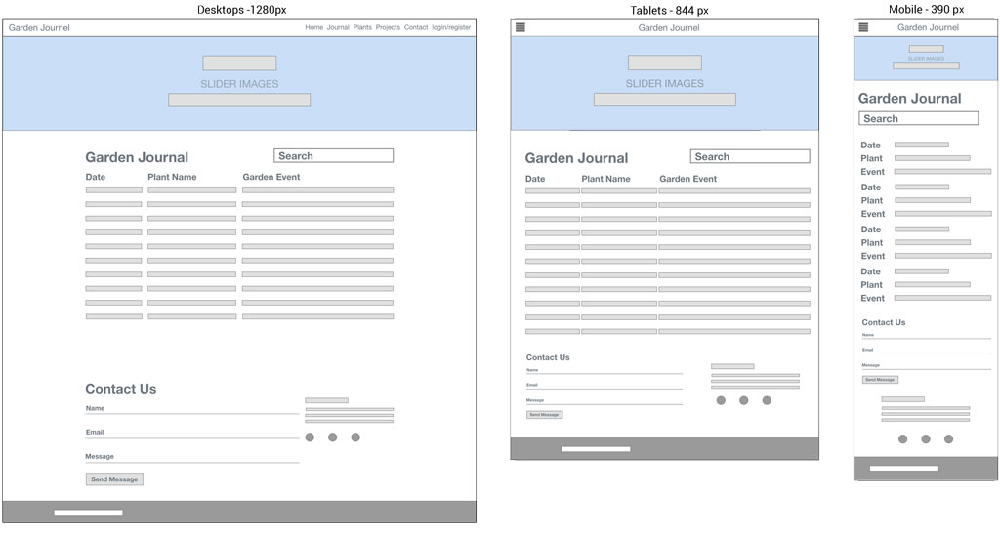

# Welcome

## Code Institute: Milestone Project 3

### Garden Almanac - Daiden Sacha - Full Stack Web Developer

View the [Garden Almanac](https://mp3-garden-journal.herokuapp.com/) on Heroku.

[Testing.md](/documentation/TESTING.md) outlines my  testing strategy, development, deployment and post deployment.

## UX DESIGN

### 1. Strategy
**User Stories:**


1. **As a hobby gardener:**

	- As a hobby gardener, I want to record yearly changes of individual plants.
	- As a hobby gardener I want to set up reminders for yearly maintenance tasks (like pruning, pest control etc.)
	- As a hobby gardener, I'm interested in recording the time of year when plants flower
	- As a hobby gardener, I would like to add my plants to a list of plants, containing information relevant to that plant. 
	- As a hobby gardener, I would like to be able to add images of the plants. 
	- As a hobby gardener, I want to edit plants and event when information so I can improve the records over time.

2. **As a vegetable gardener:**

	- As a vegetable gardener, I would like to set a reminder when the last frost is, so I know when it is safe to plant outside.
	- As a vegetable gardener, I want to set reminders for when to plant particular seeds, so they are ready to plant out after the last frost.
	- As a vegetable gardener, I want to record regular or yearly maintenance tasks, so I don't forget them.
	- As a vegetable gardener, I want to know when my fruit and vegetable crops are ready to pick.
	-  As a vegetable gardener, I want to edit plants and event when information so I can improve the records over time.

1.  **As the owner:**
	- I want to engage gardening enthusiasts with the goal to build up a user base of registered users.
	- I want to build a base of registered users with a view towards developing a social network of users with the similar interest in gardening.
	- I envisage that I will be able to add pages to market a raised garden bed that I designed for growing vegetables.
	- I want users to register and log in to access the journal with garden reminders and tasks.

### 2. Scope

**Required Features**
- **All Users:**
	- **Home page** The landing page will be light and fresh, with images of nature and plants.
		- **Search Filter** A search input above the collapsible on the almanac page searches the event, catefores, months, plants. 
		- **Image slider** will be the main eye-catching feature of the landing page, visible as soon as users arrive at the landing page. 
		- **Material Box** Material Design implementation of the Lightbox plugin to display images. Used to display images of nature, to inspire and connect with users. 
		- **Navbar**
			- **Contact Form Link** will link users to the contact form.
			- **Log in link** will open the login form for users to log in. 
			- **Register link** will open the register form for users to register. 
		- **Footer** Will hold the social links and contact icon link. 
			- **Social Icons** in the footer so users can open my GitHub and LinkedIn profiles. 
	- **Contact page** Will display the contact form. 
		- **Contact form** for users to send messages to site admin.
	- **Login Page** with the login form. 
		- **Login Form** for users to log in. 
	- **Register Page** with the register form.
		- **Register Form** for users to register.


- **Registered Users:**
	- **Navbar** - The Navbar for registered users who log in will display additional links to the journal page, plants page, add garden event page, add plants page, and add categories page. 
	- **Journal page** - To display the session user's garden events in the Material Design Collapsible.
		-	**Materializecss Collapsible** - For viewing Garden Events. The header will display the event date in month/ day format. It will show the event name
		 - **Edit button** - So user scan open the edit garden event and edit plant forms.
	- **Plants page** - To display the session user's plants in the Material Design styles collection (list)
	- **Profile page** - To display the session user's profile in the disabled form inputs.
	- **Materializecss Collection** - A Material Design style list for displaying the plants. 
		 - **Edit button**, so user scan open the edit garden event and edit plant forms.

	- **Forms**
		- **Create plant** -  So users can create and add their plants
		- **Create Garden Event** - So users can add garden events
		- **Create Category** - So users can create event categories.
		- **Update plant** - So users can edit and update plant information.
		- **Update Garden Event** - So users can edit and update garden event information. 
		- **Update Category** - So users can edit and update garden event categories.  
		- **User Profile Form** (disabled for viewing only) - To display the user profile. 
		- **Update Profile Form** - So users can update select profile information.

	- **Modals**
		- **View Plant Modal** - Will open when the user clicks on the plant in the list. I will display the plant information, and have an edit button. 
			- **Edit button** - When the user clicks the button, they will be redirected to the edit plant page, displaying the plant information in the update plant form.
		- **Delete Plant Modal** - The modal will open when the user has clicked to delete a plant. It will display a danger alert, informing the user that the action is irreversible. 
			- **Delete Button** By clicking this button, the user confirms they want to delete the plant data. When clicked, the plant data will be deleted, and the user will be redirected to the plants page. 
			- **Cancel Button** When the user clicks this button to cancel their intention to delete the plant, the modal will close, and the user will be redirected to the plant's page. 
		- **Delete Garden Event Modal** - The modal will open when the user has clicked to delete a garden event. The modal will display a danger alert, informing the user that deleting data is irreversible.  
			- **Delete Button** By clicking this button, the user confirms they want to delete the garden event data. When clicked, the event data will be deleted, and the user will be redirected to the journal page. 
			- **Cancel Button** When the user clicks this button to cancel their intention to delete the garden event, the modal will close, and the user will be redirected to the journal page. 
		- **Delete Category Modal** - The modal will open when the user has clicked to delete an event category. The modal will display a danger alert, informing the user that deleting data is irreversible.  
			- **Delete Button** By clicking this button, the user confirms they want to delete the event category. When clicked, the category will be deleted, and the user will be redirected to the add category page. 
			- **Cancel Button** When the user clicks this button to cancel their intention to delete the event category, the modal will close, and the user will be redirected to the add category page. 

- **Admin Users**
	- **Navbar** The Navbar for admin will display an additional link to the messages page.  
		- **Messages page** to display the session user messages.
			- **Materialize Collapsible** for viewing messages, The header of the collapsible with have a delete button, that will open the confirm delete modal when clicked.
				- **Delete button** - So admin can delete the user messages.
			- **Delete Message Modal** - The modal will open when the user has clicked to delete a message. The modal will display a danger alert, informing the user that deleting the message is irreversible.  
				- **Delete button** - So admin can confirm deletion of the user message.
				- **Send Email button** - To reply to the user in the default email app of the computer. 

**Functional Requirements**
- **Image slider** It will have 4 images, and will automatically scroll at intervals of around 10 seconds, enough time for the image to be viewed by the user. The transition of the images, each representing a season, relates to the cyclical nature of existence and events. The images will give the impression of looking through a window.
- **Material Box** Images in the Lightbox plugin will expand when clicked, and revert to their initial display when the screen is clicked again. The images are to illustrate the beauty of nature. 
- **Navbar** The Navbar for non session users will display links to the login page, register page, and contact page.
- **Contact Form** The form inputs will have multiple levels of validation. 
	- **Browser side validation** will utilize the Material Design class `validate`. When the fields are clicked without filling them in, a red line will appear under the input. If the user has not filled in the input, a tooltip message will appear asking the user to fill in the input. 
	- **Server Side Validation** is handled by Flask-WTForms, and defined in the form class. Inputs that fail validation will display a red message under the input, informing the user what needed for the input to pass validation. An error alert will appear, informing the user validation has failed. When the form validates, the information is sent, a success alert appears with a message informing the user the message has been sent. 
- **Login Page** The user will be required to enter their username and password to log in. If they enter correctly, they will be redirected to the profile page, and the additional functionality will be available for the user. If they enter incorrect information, an error alert appears, informing the user the details were incorrect. 
- **Registration Page** The user registers by completing all the fields in the registraion form. The fields are valididated by the browser, and a tooltip appear with a validation message if a field fails validation. If the form passes validation, the user is looged in and redirected to the profile page.
-	**Materializecss Collapsible** The collapsible is closed by default, and the user can click on the header to open the accordion. The header displays the "Month/ Day", event category, and event name. When opened, the event and plant information is displayed for the event. An edit button for the plant, and one for the event, link to the respective edit pages. 
- **Search Filter** The use can fliter events by events name, category, month to easliy find required events.  

**Content Requirements**
The garden almanac revolves arount creating a record of recurring events in the garden. The goal is to develop and improve knowledge based on historical experience recorded in the events, plants, and categories of the application. The data is broght together to display a yearly event calendar so the user can manage and get teh most our of teh garden. SOme fields in the forms for entering the data is required so the events and plants can be displayed.Other fields are optional, so the user can enter this content if it suits them. 

### 3. Structure
**Interaction Design**
**ALL USERS:** The site is one page with a contact form in the bottom of the page, with a link to it in the Navbar. 
Unregistered unsers are limited to viewing the homepage, withh an option to register via the link in the Navbar. They can also send a message via the contact form. 
- ***Contact Page:*** Users will be able to contact me to give feeedback, or to ask for support, or feature requests. Contact easliy accessibel from main Navbar, or a link in the footer. 

**REGISTERED USERS:** Registered users can login, and this enables additional links in the Navbar, to a Journal page, and Plants page. 
- ***Journal page:*** 
	- A search filter will be positioned above the accordion on the page, so the user can enter month, plant name, event category to easily filter the events. This will improve UX as the list of events grows. 
	- An accordion will display the events, and all list items in the accordion will be closed by default, and ordered by date. Being an almanac, items will be ordered by month and day, to reflect the cyclical nature of events. User can click on an event and the accordion item will open, displaying the event and related plant, with edit buttons to be able to directly open and edit either item. 
	
- ***Plant Page:*** 
	- The plant page displays a list of the users plants. 
	- The user can click on a plant, which will open a modal displaying the users plant information. 
	- The modal will have an edit button that will link to an update plant page, where the user can update or delete the plant information.
	
- ***Profile Page:*** 
	- A disabled form on the page will display the registered users information. There will be an edit button that will open an edit profile page, with some fields editable so the user can udpate their information.*

**Information Architecture** 
 There will be 3 pages for the site, with only the Homepage being accessable to users that are not registered or logged in. 
 
 **CRUD Update forms** 
 - ***Forms:*** Information for each user will be displayed in pages, and will contain edit links that will redirect to the update/edit page where the the forms will automatically display the item to be edited. Some fields in the related forms will be required, other optional, but clearly labelled. The user will be able to change and update the information easily, and will be redirected back to the related item group. The update forms will have a save, delete, or cancel button for the user. 

**CRUD Delete structure** 
- ***Forms and delete process*** The user can click the delete button on the update item page, which will open a modal with a danger alert, informing the user that deleting the data is irreversable. They can choose from the delete, or cancel buttons, to delete, or cancel and return to the related items group page. 
   
- **Visible to all users**
   - ***Homepage***
	   - Home page navigation will link to the contact form at the bottom of the page, also the login/ registration form. 
	   - There will be a slider with images relating to the four seasons. These images are a feature, and I kept them in the base template so they are viewable on all pages. 
	   - A collection of images to inspire interest in gardening. 
	   - 
- **Additional pages visable to registered and logged in users** 
   - ***Journal page***
	   - Will display the the events for the users garden.
	   - Buttons to open a form to add, update or delete an event will open a modal window to perform the action. 
	   - Event name along with the plant name will be links that will open the corresponding entry to be viewed, updated or deleted.  
   - ***Plants Page***
	   - Will display a list of the  plants entered by the user.
	   - The plant name in the list will be a link that opens the plant profile in a modal window to be viewed, updated, or deleted.
	   
### MongoDB  

I decided to create separate collections for users, event categories, and plants. the fourth collection will be the garden events, which will contain the information about the event. Within the garden event entry, I will record the plant id, the user id, and categoy, to make it easy to filter the data base for the information. During development, I had the idea to create a message feature for the admin, and display sent messages in the back end. To this end, I created one more collection for messages. 

**MongoDB Schema**

I decided on the following schema, using collections to group separate groups of data, users, plants, categories (event), garden_events, and messages. 

***Users***
The whole site revoles around the users, so the user name is what links the plants, events and categores, where I use the `user_name`and insert it as in the related entry `created_by` key. I am able to use this as the sudo foreign key to identify the users entries. 
```  
	users  {
			_id: <ObjectId>
			user_name: <string>
			user_email: <string>
			user_joined: <date>
			user_firstname: <string>
			user_lastname: <string>
			user_password: <string> 
       }
```  
***Plants***
I used a combination of fields to so the user can record information, and update it each year based on the past years experience. Some fields are required, so there is a minimum of information so I can populate the pages with something relevant for the user Other fields are optional, so the user can cater for a variety of plants, ornamental or productive. 
```   
	plants  {
			_id: <ObjectId>
		    plant_type: <string>
		    plant_name: <string>
		    plant_sowing: <date>
		    plant_planting: <date>
		    harvest_from: <date>
		    harvest_to: <date>
		    fertilise_frequency: <string>
		    fertiliser_type: <string>
		    plant_note: <string>
		    created_by: <string>  
     }
```   
***Categories***
The user has total discretion to group the types of events how they prefer, which will suit their needs and desire to search or filter infomtation. 
```  
	categories  {
		     _id: <ObjectId>
		     event_category: <string>
		     created_by: <string>
	 }
```
***Garden Events***
The pivot of the whole concept, depends on and requires category and plants to create an event. Initially I used the plant ObjectId as the sudo foreign key, as it is unique to the plant, and immutable. Like the events, some fields are required, and other optional. I stored dates in ISODate format. I also stored the date in month string format, and included them in the indexing of the database so users can enter month names to filter events by month.  
``` 
	garden_events {
			 _id: <ObjectId>
			 event_category: <string>
			 event_plant_id: <ObjectId>
			 event_name: <string>
			 event_repeats: <string>
			 event_date: <date>
			 event_month: <string>
			 event_notes: <string>
			 created_by: <string>
	 }
```
***Messages***
This was not in my initial plan, but was inpired when I was working out what to do with my contact form data. For the sake of the learnign process, I resisted using JS to handle the form and send it via a third party. I used `flask-wtf` forms to build the form and validation. In a moment of enlightenment, I had the idea to create the collection to store the message data, and I created a Admin Message Inbox to display the messages. 
```  
	messages  {
		     _id: <ObjectId>
		     first_name: <string>
		     last_name: <string>
		     email: <string>
		     message: <string>
		     date_time: <date>
	 }
```

### 4. Skeleton

**Wireframing:**
The wireframes were compelted in Adobe XD, and I kept them simple, to display the layout of the required complonents. I have used Materializecss as the framework, and based my work around a simple free template I found at [materializecss themes](http://swarnakishore.github.io/MaterializeThemes/#themes). 
#### Home page wireframes


#### Journal page wireframes


#### Plants page wireframes


### 5. Surface

**Visual Design:**
I selected four stock images, one to represent each season, to display in a carousel slider directly under the navigation. The image carousel is set to automatically change images every 10 seconds, so the user has time to view each image. This feature will be visable on all pages, along with the navbar. 

I have included the contact form at the bottom of the page so the users can easily contact me, and there is a link in the navbar that scrolls the page to the cotnact form. 

I inlcuded images of fruit and vegetables to inspire users to make use of the application. Event names and plant names open the corresponding events and plant profiles, which can be easily viewed, updated or deleted. That happens in a modal that when closed returns the user to the same page. The navigation bar is fixed so it's easily accessible and always visible. The site is simple and the styling and functions consistant accross pages. 

## TECHNOLOGIES USED

**Languages Used**
1.  HTML
2.  CSS3
3.  SCSS
4.  JavaScript
5.  jQuery
6.  Python
7.  Jinja
8.  Markdown

**Frameworks, Libraries, Programs used**

1. [Material Design Framework](https://materializecss.com/getting-started.html)
	Responsive framework of choice for this project.
2. [Flask Framework](https://flask.palletsprojects.com/en/2.0.x/) 
     Used to display data from the mongoDB in the front end templates.
3. [Heroku](https://www.heroku.com/home)
	Hosting the project.
4. [mongoDB](https://www.mongodb.com/)
5. noSQL database used to store non-relational data of the website.
6. [Flask-WTForms](https://flask-wtf.readthedocs.io/en/0.15.x/) 
    A simple integration of Flask and WTForms, offering validation and implementation using Jinja. 
7. [Font Awesome](https://fontawesome.com/)
	Icons used in the website.
8. [GitHub](https://github.com/)
	Used to host project repository and to deploy the project live via 	GitHub Pages
9. [Git Version Control](https://git-scm.com/)
	I used it to commit blocks of work to the GitHub repository and create branches to work on specific changes or testing.
10. [Gitpod](https://gitpod.io/workspaces)
	Editor used to work on project.
11. [Adobe XD](https://www.adobe.com/products/xd.html) 
	Used to create wireframes
12. [Adobe Photoshop](https://www.adobe.com/products/photoshop.html)
	Used to edit images for the site.
13. [Adobe Illustrator](https://www.adobe.com/de/creativecloud.html?mv=search&mv=search&sdid=MQH8S7GK&ef_id=Cj0KCQjwgtWDBhDZARIsADEKwgPZA7lnHvCbzk4T9-Q7HVENkRXnk1GxIseaWipJrYnWF0LQvFTw21MaAlQ6EALw_wcB:G:s&s_kwcid=AL!3085!3!392740825380!b!!g!!%2badobe!1419110055!55481570853&gclid=Cj0KCQjwgtWDBhDZARIsADEKwgPZA7lnHvCbzk4T9-Q7HVENkRXnk1GxIseaWipJrYnWF0LQvFTw21MaAlQ6EALw_wcB)
	Used to create my 404, 405 and 500 error images to display if users encounted missing or broken page links.
14. [Squoosh](https://squoosh.app/)
	I used it to compress images to optimize load performance.
15. [Quire](https://quire.io/)
Free project and task planning application used for adding and planning tasks for the project.
16. [Depositphotos](https://depositphotos.com/?gclsrc=aw.ds&&utm_source=google&utm_medium=cpc&utm_campaign=DP_EU_EN_Brand_Search&utm_term=depositphotos&gclid=CjwKCAjwuvmHBhAxEiwAWAYj-EVeHDBPdjs594mAT_HDLeFGM_g2IVcGn78NSArH7vXIYqfoO1BuhBoCv_kQAvD_BwE)
My source of choice for stock images.
17. [StackEdit](https://stackedit.io/)
	It's a free, online note-taking and markdown application. I used it to create the README file for GitHub.
18. [Webmaker App](https://webmaker.app/app/) It is a free application similar to codepen, used to create and save the work locally. I use it to implement and experiment with using components of different frameowrks that I am using, so I am familiar with how to use them when I come to implementing them in my work. 

## TESTING
Link to testing file.
[To Testing.md](https://github.com/daidensacha/mp3-garden-journal/blob/master/documentation/testing.md)
### Deployment

**Deploy to Heroku**
1. Setup pages required by Heroku to run app.
	- In the console  I run `pip3 freeze --local > requirements.txt` . It creates the file `requirements.txt` and lists all the dependencies needed to run the application. 
	- I create the Procfile by typing `echo web: python app.py > Procfile` in terminal. 
	- I remove the black line at the bottom of the Procfile, which can cause problems running the app on Heroku.
2. I go to heroku.com, 
	-  I log in, and in the user dashboard click "create new app". 
	- I create a unique app name, using lower case, dashes and or underscores. 
	- I select the region closest to me (Frankfurt), and click "create app",
3. Setup automatic deployment from my GitHub repository.
	- With my GitHub usename displayed, I enter the repository name, and click search.
	- It finds my repo and I click "connect to this app".
4. Add evironment variables that are in a hidden file env.py that is not commited with the app.
	- I click on the "Settings" tab for my app, and then click on "Reveal Config Vars".
	- I enter the key-value pairs, minus quotes.
	- I leave the MONGO_URI value empty as i don't have that yet.
	- Before deploying, i commit and push my 2 new files to the repository. 
	- I complete the git command, `git status`, `git add `. `git commit -m "add requirements.txt and Procfile"`, then `git push`. 
5. Back in Heroku, I click "deploy branch"
6. After about short wait, Heroku has received the code from GitHub, built the app, and a message says, "Your app has been successfully deployed".
7. To confirm, I click "View" to launch the app.
8. 
### Feedback

### Credits
***Flask App*** 
Without the Code Institute code along [Task Manager project](https://github.com/Code-Institute-Solutions/TaskManagerAuth) as a reference, I feel this project would have been far more difficult. Time and time again I referred back to examples in the Task Manager project to grasp a concept, or to find my way through a situation.  
***Theme inspiration*** 
I came across some [materializecss themes](http://swarnakishore.github.io/MaterializeThemes/#themes), and used them as the inspiration to develop my own theme template. I had to update the markup a little for the latest  version of marterializecss, and customised the theme to my own needs. But anylising these thems helped me to get a grasp of the structure and function of materializecss elements. 

## NOTES


## IMPROVEMENTS


## BUGS

